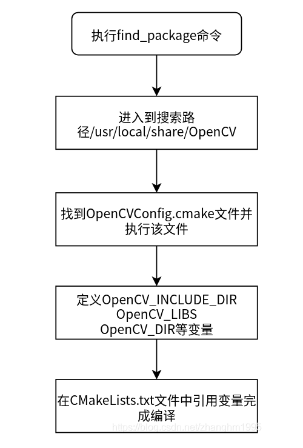

# Find_package 

## **1、find_packakge命令基本介绍** 

> ​		在我们实际开发过程中，经常不可避免会使用到第三方开源库，这些开源库可能是通过apt-get install命令自动安装到系统目录中，也可能是由我们自己下载库的源码然后通过编译安装到指令目录下的。
>
> ​		不管哪种方式安装的库文件，如果我们需要自己的项目中使用这些库，首先面临的第一个问题就是如何找到这些库。所谓“找到”这些库，其实是根据我们的需要找到指定版本的库头文件包含路径、链接库路径等，从而能够满足我们开发项目的编译链接需要。
>
> ​		在没有CMake的时代，这种库查找链接的工作都需要借助MakeFile中的各种命令来完成，非常的繁琐，而且不方便移植，到了CMake时代，CMake给我们提供了find_package()命令用来查找依赖包，理想情况下，一句find_package()命令就能把一整个依赖包的头文件包含路径、库路径、库名字、版本号等情况都获取到，后续只管用就好了。但实际使用过程可能会出现这样那样的问题，因此需要我们对find_package这个强大的命令有个大概的理解。 

## **2、一个使用find_package命令的例子** 

为了能够帮助大家理解find_package命令的用法，此处首先用OpenCV库举例子，示范如何通过find_pakcage命令找到OpenCV库并配置，从而能够在我们自己的项目中调用OpenCV库，实现特定的功能。 

**opencv_test.cpp:** 

```
#include <cstdio> 
#include <iostream> 
#include <opencv2/opencv.hpp> 

using namespace cv; 

int main() { 
  Mat image; 
  image = imread("../opencv_test.jpg"); 
 
  if (!image.data) { 
    printf("No image data\n"); 
    return -1; 
  } 

  namedWindow("Display Image", CV_WINDOW_AUTOSIZE); 
  imshow("Display Image", image); 
  waitKey(0); 
  return 0; 
} 
```

**CMakeLists.txt:** 

```
cmake_minimum_required(VERSION 2.8) 
project(find_package_learning) 
find_package(OpenCV 3 REQUIRED) 

 
message(STATUS "OpenCV_DIR = ${OpenCV_DIR}") 
message(STATUS "OpenCV_INCLUDE_DIRS = ${OpenCV_INCLUDE_DIRS}") 
message(STATUS "OpenCV_LIBS = ${OpenCV_LIBS}") 

 
include_directories(${OPENCV_INCLUDE_DIRS})   
add_executable(opencv_test opencv_test.cpp)   
target_link_libraries(opencv_test ${OpenCV_LIBS}) 
```

### **2.1**编译输出与分析

```
-- The C compiler identification is GNU 7.5.0 
-- The CXX compiler identification is GNU 7.5.0 
-- Check for working C compiler: /usr/bin/cc 
-- Check for working C compiler: /usr/bin/cc -- works 
-- Detecting C compiler ABI info 
-- Detecting C compiler ABI info - done 
-- Detecting C compile features 
-- Detecting C compile features - done 
-- Check for working CXX compiler: /usr/bin/c++ 
-- Check for working CXX compiler: /usr/bin/c++ -- works 
-- Detecting CXX compiler ABI info 
-- Detecting CXX compiler ABI info - done 
-- Detecting CXX compile features 
-- Detecting CXX compile features - done 
-- Found OpenCV: /usr/local (found suitable version "3.4.4", minimum required is "3")  
-- OpenCV_DIR = /usr/local/share/OpenCV 
-- OpenCV_INCLUDE_DIRS = /usr/local/include;/usr/local/include/opencv 
-- OpenCV_LIBS = opencv_calib3d;opencv_core;opencv_dnn;opencv_features2d;opencv_flann;opencv_highgui;opencv_imgcodecs;opencv_imgproc;opencv_ml;opencv_objdetect;opencv_photo;opencv_shape;opencv_stitching;opencv_superres;opencv_video;opencv_videoio;opencv_videostab;opencv_viz;opencv_aruco;opencv_bgsegm;opencv_bioinspired;opencv_ccalib;opencv_cvv;opencv_datasets;opencv_dnn_objdetect;opencv_dpm;opencv_face;opencv_freetype;opencv_fuzzy;opencv_hdf;opencv_hfs;opencv_img_hash;opencv_line_descriptor;opencv_optflow;opencv_phase_unwrapping;opencv_plot;opencv_reg;opencv_rgbd;opencv_saliency;opencv_stereo;opencv_structured_light;opencv_surface_matching;opencv_text;opencv_tracking;opencv_xfeatures2d;opencv_ximgproc;opencv_xobjdetect;opencv_xphoto 
-- Configuring done 
-- Generating done 
-- Build files have been written to: /home/zhanghm/Programming/programming-learning-examples/cmake_learning/learn_cmake_easily/find_package_learning/build 
```

重点看下其中OpenCV_DIR、OpenCV_INCLUDE_DIRS和OpenCV_LIBS打印的结果，这是我在CMakeLists.txt中用message命令输出这三个变量的值的结果。 

可以看到在执行find_package(OpenCV 3 REQUIRED)命令后，CMake找到了我们安装的位于/usr/local下的OpenCV库，并设置了CMake变量OpenCV_DIR为OpenCV库的配置文件所在路径，正是通过载入这个路径下的OpenCVConfig.cmake配置文件才能配置好OpenCV库，然后在OpenCVConfig.cmake配置文件中定义了变量OpenCV_INCLUDE_DIRS为OpenCV库头文件包含路径，这样我们才能才在代码中使用#include <opencv2/opencv.hpp>而不会出现编译错误，同时定义了变量OpenCV_LIBS为OpenCV链接库路径，这样我们才能正确链接到OpenCV中的库文件，而不会出现类似未定义的引用这样的链接错误。 



通过这个例子就可以看出find_package本质上就是一个搜包的命令，通过一些特定的规则找到<package_name>Config.cmake包配置文件，通过执行该配置文件，从而定义了一系列的变量，通过这些变量就可以准确定位到OpenCV库的头文件和库文件，完成编译。 

那么关键的问题来了，find_package命令是怎么能够定位并载入指定库的配置文件的呢？这就需要梳理一下find_package命令的搜包过程。 

## **3、find_package命令搜包过程** 

首先我们需要明确一点，CMake本身不提供任何搜索库的便捷方法，所有搜索库并给变量赋值的操作必须由CMake代码完成，也就是上述中的XXXConfig.cmake以及下面将要提到的FindXXX.cmake配置文件。只不过，库的作者通常会提供这两个文件，以方便使用者调用。

### **3.1 find_package工作模式** 

find_package命令有两种工作模式，这两种工作模式的不同决定了其搜包路径的不同： 

`Module模式` 

find_package命令基础工作模式(Basic Signature)，也是默认工作模式。 

`Config模式` 

find_package命令高级工作模式(Full Signature)。 只有在find_package()中指定CONFIG、NO_MODULE等关键字，或者Module模式查找失败后才会进入到Config模式。 

因此find_package工作模式流程图为： 

.png)

### **3.2 Module模式用法** 

**Module**模式的参数为：

```
find_package(<package> [version] [EXACT] [QUIET] [MODULE] 
             [REQUIRED] [[COMPONENTS] [components...]] 
             [OPTIONAL_COMPONENTS components...] 
             [NO_POLICY_SCOPE]) 
```

参数解释： 

`package`：必填参数。需要查找的包名，注意大小写。 

`version`和`EXACT`：可选参数，version指定的是版本，如果指定就必须检查找到的包的版本是否和version兼容。如果指定EXACT则表示必须完全匹配的版本而不是兼容版本就可以。 

`QUIET`：可选参数，表示如果查找失败，不会在屏幕进行输出（但是如果指定了REQUIRED字段，则QUIET无效，仍然会输出查找失败提示语）。 

`MODULE`：可选字段。前面提到说“如果Module模式查找失败则回退到Config模式进行查找”，但是假如加入了MODULE选项，那么就只在Module模式查找，如果Module模式下查找失败并不切换到Config模式查找。 

`REQUIRED`：可选字段。表示一定要找到包，找不到的话就立即停掉整个CMake。而如果不指定REQUIRED则CMake会继续执行。 

`COMPONENTS`，components：可选字段，表示查找的包中必须要找到的组件(components），如果有任何一个找不到就算失败，类似于REQUIRED，导致CMake停止执行。 

**Module模式查找顺序** 

Module模式下是要查找到名为Find<PackageName>.cmake的配置文件。 

Module模式只有两个查找路径：`CMAKE_MODULE_PATH`和`CMake安装路径下的Modules目录`， 

搜包路径依次为： 

```
CMAKE_MODULE_PATH 
CMAKE_ROOT
```

先在CMAKE_MODULE_PATH变量对应的路径中查找。如果路径为空，或者路径中查找失败，则在CMake安装目录（即CMAKE_ROOT变量）下的Modules目录下（通常为/usr/share/cmake-3.10/Modules，3.10是我的CMake版本）查找。这两个变量可以在CMakeLists.txt文件中打印查看具体内容： 

```
message(STATUS "CMAKE_MODULE_PATH = ${CMAKE_MODULE_PATH}") 
message(STATUS "CMAKE_ROOT = ${CMAKE_ROOT}") 
```

其中**CMAKE_MODULE_PATH**默认为空，可以利用set命令赋值。 

在安装CMake时，CMake为我们提供了很多开发库的FindXXX.cmake模块文件，可以通过命令查询： 

```
cmake --help-module-list | grep -E ^Find 
```

### 3.3 Config模式用法 

Config模式的完整命令参数为： 

```
find_package(<package> [version] [EXACT] [QUIET] 
             [REQUIRED] [[COMPONENTS] [components...]] 
             [CONFIG|NO_MODULE] 
             [NO_POLICY_SCOPE] 
             [NAMES name1 [name2 ...]] 
             [CONFIGS config1 [config2 ...]] 
             [HINTS path1 [path2 ... ]] 
             [PATHS path1 [path2 ... ]] 
             [PATH_SUFFIXES suffix1 [suffix2 ...]] 
             [NO_DEFAULT_PATH] 
             [NO_CMAKE_ENVIRONMENT_PATH] 
             [NO_CMAKE_PATH] 
             [NO_SYSTEM_ENVIRONMENT_PATH] 
             [NO_CMAKE_PACKAGE_REGISTRY] 
             [NO_CMAKE_BUILDS_PATH] # Deprecated; does nothing. 
             [NO_CMAKE_SYSTEM_PATH] 
             [NO_CMAKE_SYSTEM_PACKAGE_REGISTRY] 
             [CMAKE_FIND_ROOT_PATH_BOTH | 
              ONLY_CMAKE_FIND_ROOT_PATH | 
              NO_CMAKE_FIND_ROOT_PATH]) 
```

相比于Module模式，Config模式的参数更多，也更复杂，但实际在使用过程中我们并不会用到所有参数，大部分参数都是可选的，我们只需要掌握基本的参数用法即可。 

其中具体查找库并给XXX_INCLUDE_DIRS和XXX_LIBRARIES两个变量赋值的操作由XXXConfig.cmake模块完成。 

两种模式看起来似乎差不多，不过CMake默认采取Module模式，如果Module模式未找到库，才会采取Config模式。如果XXX_DIR路径下找不到XXXConfig.cmake文件，则会找/usr/local/lib/cmake/XXX/中的XXXConfig.cmake文件。总之，Config模式是一个备选策略。通常，库安装时会拷贝一份XXXConfig.cmake到系统目录中，因此在没有显式指定搜索路径时也可以顺利找到。 

#### Config模式查找顺序 

Config模式下是要查找名为<PackageName>Config.cmake或<lower-case-package-name>-config.cmake的模块文件。  

搜包路径依次为： 

与Module模式不同，Config模式需要查找的路径非常多，也要匹配很多的可能性，因此有些路径是首先作为根目录，然后进行子目录的匹配，我会进行说明。  

具体查找顺序为： 

1、名为<PackageName>_DIR的CMake变量或环境变量路径 

默认为空。 

这个路径是非根目录路径，需要指定到<PackageName>Config.cmake或<lower-case-package-name>-config.cmake文件所在目录才能找到。 

2、名为CMAKE_PREFIX_PATH、CMAKE_FRAMEWORK_PATH、CMAKE_APPBUNDLE_PATH的CMake变量或环境变量路径 

根目录，默认都为空。 

注意如果你电脑中安装了ROS并配置好之后，你在终端执行echo $CMAKE_PREFIX_PATH会发现ROS会将CMAKE_PREFIX_PATH这个变量设置为ROS中的库的路径，意思是会首先查找ROS安装的库，如果恰好你在ROS中安装了OpenCV库，就会发现首先找到的是ROS中的OpenCV，而不是你自己安装到系统中的OpenCV。 

3、PATH环境变量路径 

根目录，默认为系统环境PATH环境变量值。 

其实这个路径才是Config模式大部分情况下能够查找到安装到系统中各种库的原因。 

这个路径的查找规则为： 

遍历PATH环境变量中的各路径，如果该路径如果以bin或sbin结尾，则自动回退到上一级目录得到根目录。例如我的PATH路径包括： 

```
$ echo $PATH 
/home/zhanghm/.local/bin:/usr/local/cuda-10.1/bin:/opt/ros/melodic/bin:/home/zhanghm/.local/bin:/usr/local/sbin:/usr/local/bin:/usr/sbin:/usr/bin:/sbin:/bin:/usr/games:/usr/local/games:/snap/bin
```

在上述指明的是根目录路径时，CMake会首先检查这些根目录路径下是否有名为<PackageName>Config.cmake或<lower-case-package-name>-config.cmake的模块文件，如果没有，CMake会继续检查或匹配这些根目录下的以下路径（<PackageName>_DIR路径不是根目录路径）： 

```
<prefix>/(lib/<arch>|lib|share)/cmake/<name>*/ 
<prefix>/(lib/<arch>|lib|share)/<name>*/  
<prefix>/(lib/<arch>|lib|share)/<name>*/(cmake|CMake)/
```

其中为系统架构名，如Ubuntu下一般为：/usr/lib/x86_64-linux-gnu，整个(lib/<arch>|lib|share)为可选路径，例如OpenCV库而言会检查或匹配<prefix>/OpenCV/、<prefix>/lib/x86_64-linux-gnu/OpenCV/、<prefix>/lib/share/OpenCV/、<prefix>/share/OpenCV/等路径；name为包名，不区分大小写<name>*意思是包名后接一些版本后等字符也是合法的，如pcl-1.9也会被找到。

### **3.4 查找指定包建议** 

上面的查找规则整体看起来好像很复杂，但其实我们在安装库的时候都会自动配置安装到对的位置，一般都不会出现问题。如果我们需要指定特定的库，我们也只需要设置优先级最高的几个变量名即可。包括下面两种情况： 

1、如果你明确知道想要查找的库<PackageName>Config.cmake或<lower-case-package-name>-config.cmake文件所在路径，为了能够准确定位到这个包，可以直接设置变量<PackageName>_DIR为具体路径，如： 

```
set(OpenCV_DIR "/home/zhanghm/Softwares/enviroment_config/opencv3_4_4/opencv/build") 
```

就可以明确需要查找的OpenCV包的路径了。 

2、如果你有多个包的配置文件需要查找，可以将这些配置文件都统一放在一个命名为cmake的文件夹下，然后设置变量CMAKE_PREFIX_PATH变量指向这个cmake文件夹路径，需要注意根据上述的匹配规则，此时每个包的配置文件需要单独放置在命名为包名的文件夹下（文件夹名不区分大小写），否则会提示找不到。 

## **4、总结** 

通过前面的描述，我相信大家已经能够基本掌握find_package命令的各种用法了，也能够在出现各种问题时自己进行问题定位。但还有一个我们需要注意的点是我们能够在自己的项目中使用find_package命令便捷进行依赖包配置的前提是这个包的开发者也是用CMake配置好了这个包，并提供了<PackageName>Config.cmake或Find<PackageName>.cmake的配置文件。 

## **参考** 

https://blog.csdn.net/zhanghm1995/article/details/105466372 

https://cmake.org/cmake/help/v3.5/command/find_package.html （官网介绍） 

https://zhuanlan.zhihu.com/p/50829542 

https://seanzhengw.github.io/blog/cmake/2018/04/23/cmake-find-package.html 

https://blog.csdn.net/bytxl/article/details/50637277 